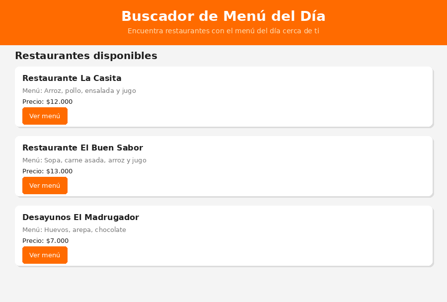
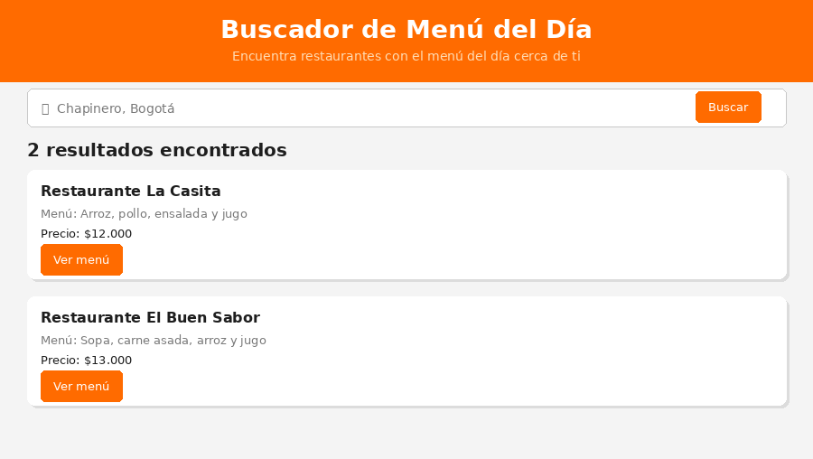
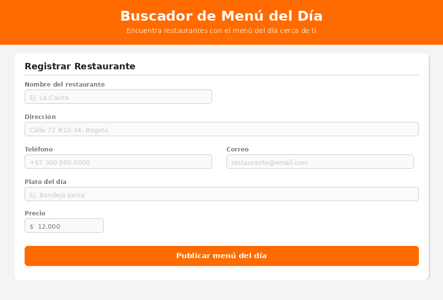
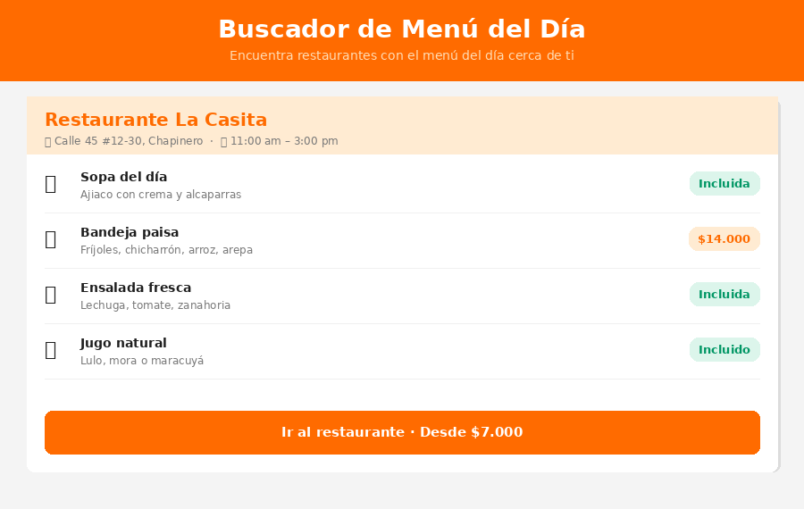

# Buscador de Menú del Día en Restaurantes

## Descripción del Proyecto
Aplicación web que permite a los trabajadores de oficina encontrar fácilmente restaurantes cercanos que ofrezcan el menú del día. Los restaurantes pueden registrar sus menús diarios con los precios para que los usuarios puedan comparar opciones rápidamente.

## Problema
Los trabajadores de oficina pierden tiempo buscando restaurantes donde almorzar o desayunar, sin conocer precios ni disponibilidad del menú del día con anticipación.

## Solución
El sistema permite que los restaurantes publiquen su menú del día para que los usuarios lo consulten desde una página web, filtrando por precio, tipo de comida y ubicación.

---

## Capturas de pantalla

### Página principal


### Resultados


### Registro de restaurante


### Menú del restaurante


---

## Modelo Entidad-Relación


> **Instrucción:** reemplaza la imagen anterior con la captura de pantalla del diagrama ER generado.

---

## Diccionario de Datos

### Tabla: USUARIO
Almacena la información de todos los usuarios del sistema. Un usuario puede ser cliente (busca restaurantes) o propietario (registra restaurantes).

| Campo      | Tipo                        | Restricción  | Descripción                                      |
|------------|-----------------------------|--------------|--------------------------------------------------|
| id         | INT                         | PK, NOT NULL | Identificador único del usuario                  |
| nombre     | VARCHAR(100)                | NOT NULL     | Nombre completo del usuario                      |
| email      | VARCHAR(150)                | NOT NULL, UNIQUE | Correo electrónico, usado para iniciar sesión |
| contrasena | VARCHAR(255)                | NOT NULL     | Contraseña cifrada del usuario                   |
| tipo       | ENUM('cliente','restaurante')| NOT NULL    | Rol del usuario en el sistema                    |

---

### Tabla: RESTAURANTE
Almacena los datos de cada restaurante registrado. Está vinculado al usuario propietario.

| Campo      | Tipo         | Restricción      | Descripción                                  |
|------------|--------------|------------------|----------------------------------------------|
| id         | INT          | PK, NOT NULL     | Identificador único del restaurante          |
| usuario_id | INT          | FK → USUARIO(id) | Usuario propietario del restaurante          |
| nombre     | VARCHAR(150) | NOT NULL         | Nombre del restaurante                       |
| direccion  | VARCHAR(200) | NOT NULL         | Dirección completa del restaurante           |
| telefono   | VARCHAR(20)  |                  | Teléfono de contacto                         |
| tipo_cocina| VARCHAR(80)  |                  | Tipo de cocina (casera, vegana, italiana…)   |
| horario    | VARCHAR(100) |                  | Horario de atención (ej. Lun-Vie 11am–3pm)  |

---

### Tabla: MENU_DEL_DIA
Registra el menú que cada restaurante publica por día. Un restaurante puede tener varias opciones de menú para el mismo día.

| Campo           | Tipo          | Restricción           | Descripción                              |
|-----------------|---------------|-----------------------|------------------------------------------|
| id              | INT           | PK, NOT NULL          | Identificador único del menú             |
| restaurante_id  | INT           | FK → RESTAURANTE(id)  | Restaurante al que pertenece el menú     |
| fecha           | DATE          | NOT NULL              | Fecha para la que aplica el menú         |
| plato_principal | VARCHAR(150)  | NOT NULL              | Nombre del plato principal               |
| precio          | DECIMAL(10,2) | NOT NULL              | Precio del menú en pesos colombianos     |
| descripcion     | TEXT          |                       | Descripción completa (sopas, jugo, etc.) |

---

### Tabla: BUSQUEDA
Guarda el historial de búsquedas realizadas por los usuarios, con los filtros aplicados.

| Campo      | Tipo          | Restricción      | Descripción                                      |
|------------|---------------|------------------|--------------------------------------------------|
| id         | INT           | PK, NOT NULL     | Identificador único de la búsqueda               |
| usuario_id | INT           | FK → USUARIO(id) | Usuario que realizó la búsqueda                  |
| ubicacion  | VARCHAR(200)  |                  | Dirección o barrio ingresado por el usuario       |
| tipo_comida| VARCHAR(80)   |                  | Tipo de comida seleccionado como filtro           |
| precio_max | DECIMAL(10,2) |                  | Precio máximo del filtro                         |
| fecha_hora | DATETIME      | NOT NULL         | Fecha y hora en que se realizó la búsqueda        |

---

### Tabla: RESULTADO
Relaciona cada búsqueda con los restaurantes que el sistema devolvió como resultado.

| Campo          | Tipo         | Restricción           | Descripción                                    |
|----------------|--------------|-----------------------|------------------------------------------------|
| id             | INT          | PK, NOT NULL          | Identificador único del resultado              |
| busqueda_id    | INT          | FK → BUSQUEDA(id)     | Búsqueda a la que pertenece este resultado     |
| restaurante_id | INT          | FK → RESTAURANTE(id)  | Restaurante encontrado                         |
| distancia_km   | DECIMAL(5,2) |                       | Distancia en kilómetros entre usuario y restaurante |

---

## Relaciones del Modelo

| Relación                      | Cardinalidad | Descripción                                              |
|-------------------------------|--------------|----------------------------------------------------------|
| USUARIO → RESTAURANTE         | 1 a N        | Un usuario puede registrar varios restaurantes           |
| USUARIO → BUSQUEDA            | 1 a N        | Un usuario puede realizar varias búsquedas               |
| RESTAURANTE → MENU_DEL_DIA   | 1 a N        | Un restaurante publica uno o más menús por día           |
| BUSQUEDA → RESULTADO          | 1 a N        | Una búsqueda puede generar varios resultados             |
| RESULTADO → RESTAURANTE       | N a 1        | Varios resultados pueden apuntar al mismo restaurante    |

---

## Funciones Principales
- Registro de usuarios y restaurantes
- Publicación del menú del día
- Búsqueda de restaurantes por ubicación y tipo de comida
- Filtrar por precio
- Ver menú completo con precios

## Tecnologías Utilizadas
- HTML
- CSS
- MySQL (base de datos)

## Cómo Ejecutar el Proyecto

1. Descarga o clona el repositorio:
   ```
   git clone https://github.com/anamaria17hv/mari777.git
   ```
2. Abre la carpeta del proyecto en tu computador.
3. Importa la base de datos ejecutando el archivo `menu_del_dia.sql` en MySQL.
4. Haz doble clic en el archivo `index.html`.
5. Se abrirá automáticamente en tu navegador web.

## Autor
Anamaria Hernandez Vasquez  
Ingeniería de Software I
